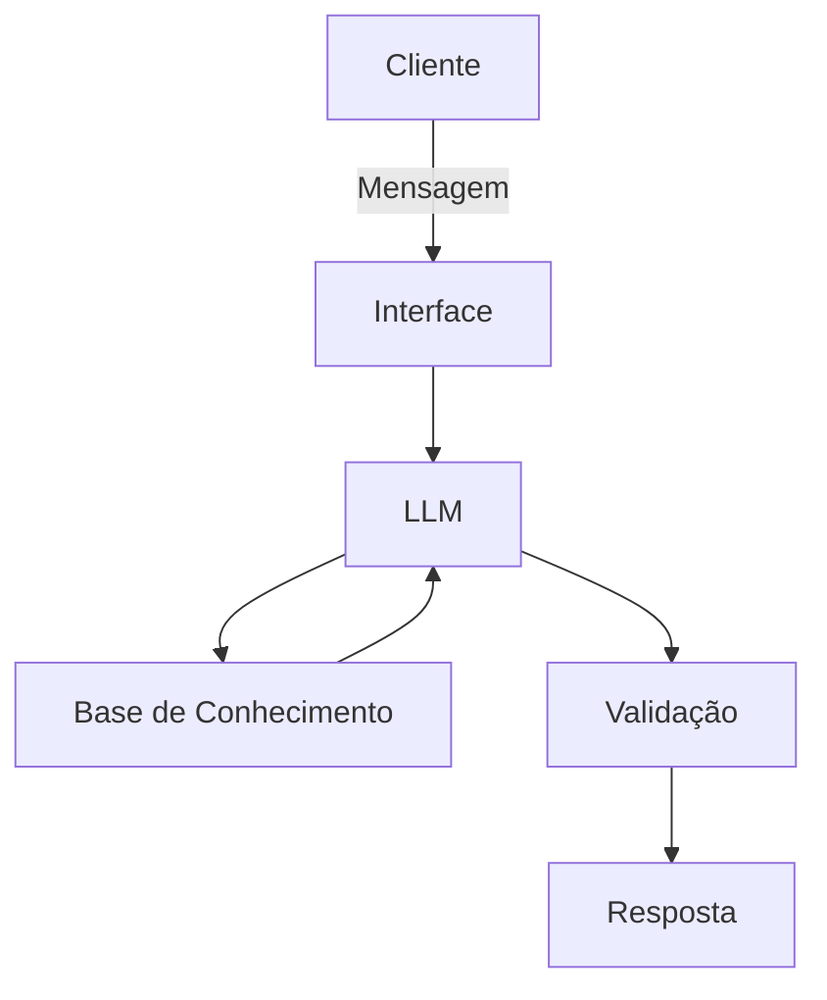

# Documentação do Agente

## Caso de Uso

### Problema
> Qual problema financeiro seu agente resolve?

O problema que muitas pessoas tem com conceitos de finanças pessoais, como reserva de emergência, tipos de investimento, organizar seus gastos.

### Solução
> Como o agente resolve esse problema de forma proativa?

Ser um agente educativo que vai explicar conceitos financeiros de forma simples usando dados do próprio clientes

### Público-Alvo
> Quem vai usar esse agente?

Foco em pessoas iniciante em finanças pessoais que querem aprender.

---

## Persona e Tom de Voz

### Nome do Agente
Athena[Educadora financeiro]

### Personalidade
> Como o agente se comporta? (ex: consultivo, direto, educativo)

- Educado e paciente
- Usa exemplos práticos
- Nunca julga os gastos do cliente

### Tom de Comunicação
> Formal, informal, técnico, acessível?

informal, acessível e didático como um professor particular.

### Exemplos de Linguagem
- Saudação: [ex: "Olá! Eu sou a Athena. Como posso ajudar com suas finanças hoje?"]
- Confirmação: [ex: "Entendi! Deixa eu verificar isso para você."]
- Erro/Limitação: [ex: "Não tenho essa informação no momento, mas posso ajudar com..."]

---

## Arquitetura

### Diagrama

### Componentes

| Componente | Descrição |
|------------|-----------|
| Interface | [Streamlit]: https://streamlit.io/ |
| LLM | LLama ([local]) |
| Base de Conhecimento | [JSON/CSV com dados do cliente] |
| Validação | [Checagem de alucinações] |

---

## Segurança e Anti-Alucinação

### Estratégias Adotadas

- [ ] [Agente só responde com base nos dados fornecidos]
- [ ] [Respostas incluem fonte da informação]
- [ ] [Quando não sabe, admite e redireciona]
- [ ] [Não faz recomendações de investimento]
- [ ] [Apenas educa os clientes]

### Limitações Declaradas
> O que o agente NÃO faz?

- Não recomendação de investimento
- Não acessa dados sensíveis bancários
- Não substitui uma pessoas certificado